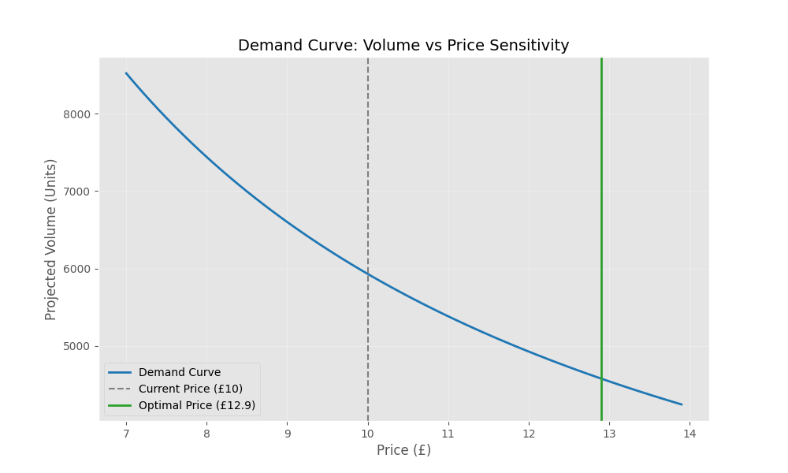
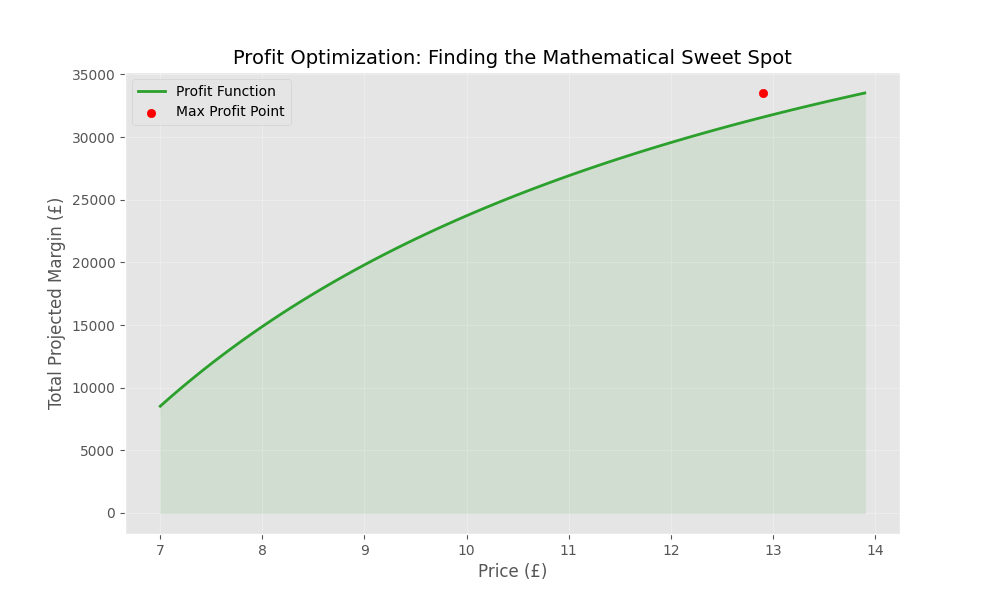
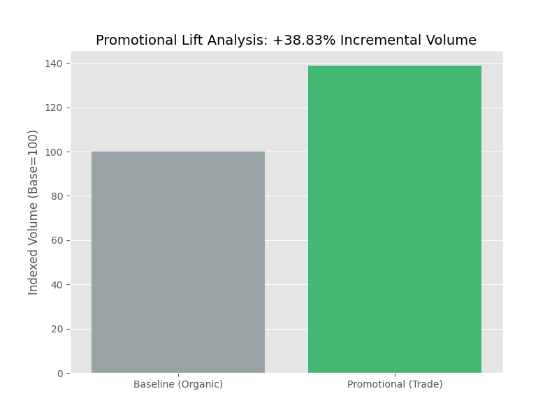

# CPG Strategic Pricing & Margin Optimization Engine

A quantitative analytical framework designed to evaluate promotional ROI and optimize pricing architectures using high-granularity scanner data.

## Analytical Methodology

This project demonstrates a high-impact data science workflow tailored for retail strategy:

### 1. Promotional ROI & Lift Decomposition
Isolated the true incremental impact of trade promotions by establishing a **Day-of-Week adjusted baseline**. By filtering for non-promotional periods, I established a control "organic" sales rate, allowing for the quantification of actual lift attributed to trade activities.

### 2. Regression-Based Price Elasticity Modeling
I implemented a **Log-Log OLS Regression** model to determine the constant price elasticity of demand. 
*   **The Approach:** Log(Quantity) ~ Log(Price) + Seasonality(DOW).
*   **The Benefit:** By using a log-log transformation, the coefficient directly represents the elasticity (e.g., a 10% price drop leading to a ~15% increase in demand), making the results instantly actionable for stakeholders.

### 3. Non-Linear Profit Simulation
Leveraged the derived elasticity coefficients to run **Scenario Simulations**. The engine tests a range of price points (+/- 30% from base) to identify the mathematical equilibrium where the trade-off between higher unit margins and lower volume maximizes total profitability.

## Strategic Insights

The following charts illustrate the engine's output for a sample category:

| Demand Sensitivity | Profit Optimization |
| :---: | :---: |
|  |  |
| *Visualizing the volume-price trade-off* | *Identifying the mathematical maximum profit* |

| Promotional Lift |
| :---: |
|  |
| *Quantifying incremental trade impact* |

---

## Technical Stack
*   **Statsmodels:** For multivariate OLS regression and statistical significance testing.
*   **NumPy/Pandas:** For large-scale scanner data processing and temporal feature engineering.
*   **Matplotlib/Seaborn:** For demand curve mapping and ROI visualization.

---

